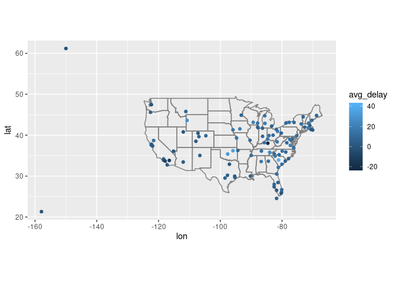

R Notebook
================

Mutating joins, add new variables to one data frame from matching
observations in another.

Filtering joins, filter observations from one data frame based on
whether or not they match an observation in the other table.

    semi_join(x, y) keeps all observations in x that have a match in y.
    anti_join(x, y) drops all observations in x that have a match in y.

Set operations treat observations as if they were set
    elements.

``` r
library(tidyverse)
```

    ## ── Attaching packages ────────────────────────────────────────────────────────────────────────────────────────────────────────────────── tidyverse 1.2.1 ──

    ## ✔ ggplot2 3.2.1     ✔ purrr   0.3.2
    ## ✔ tibble  2.1.3     ✔ dplyr   0.8.3
    ## ✔ tidyr   1.0.0     ✔ stringr 1.4.0
    ## ✔ readr   1.3.1     ✔ forcats 0.4.0

    ## ── Conflicts ───────────────────────────────────────────────────────────────────────────────────────────────────────────────────── tidyverse_conflicts() ──
    ## ✖ dplyr::filter() masks stats::filter()
    ## ✖ dplyr::lag()    masks stats::lag()

``` r
library(nycflights13)
library(Lahman)
library(babynames)
library(nasaweather)
```

    ## 
    ## Attaching package: 'nasaweather'

    ## The following object is masked from 'package:dplyr':
    ## 
    ##     storms

``` r
library(fueleconomy)
library(ggplot2)
```

Exercises:

1.You would only need the flights table, with the origin and destination
variables 2. The airports table and weather table can be merged by
matching origin 3.It would align with the destinations of flights 4.
Year, Month, Day, Hour, \#\_of\_People. The keys would be time data.

Primary key identifies its own table, foreign key uniquely identifies
and observation in another table

If a table contains multiple values that are the same….it isn’t a
KEY\!\!\! you can check

planes %\>% count(tailnum) %\>% filter( n\> 1)

If a table doesn’t seem to hold unique values anywhere, you can add your
own key in. Use mutate() and row\_number()

Exercises

``` r
flights %>%
  mutate(flight_id = row_number()) %>%
  glimpse()
```

    ## Observations: 336,776
    ## Variables: 20
    ## $ year           <int> 2013, 2013, 2013, 2013, 2013, 2013, 2013, 2013, 2…
    ## $ month          <int> 1, 1, 1, 1, 1, 1, 1, 1, 1, 1, 1, 1, 1, 1, 1, 1, 1…
    ## $ day            <int> 1, 1, 1, 1, 1, 1, 1, 1, 1, 1, 1, 1, 1, 1, 1, 1, 1…
    ## $ dep_time       <int> 517, 533, 542, 544, 554, 554, 555, 557, 557, 558,…
    ## $ sched_dep_time <int> 515, 529, 540, 545, 600, 558, 600, 600, 600, 600,…
    ## $ dep_delay      <dbl> 2, 4, 2, -1, -6, -4, -5, -3, -3, -2, -2, -2, -2, …
    ## $ arr_time       <int> 830, 850, 923, 1004, 812, 740, 913, 709, 838, 753…
    ## $ sched_arr_time <int> 819, 830, 850, 1022, 837, 728, 854, 723, 846, 745…
    ## $ arr_delay      <dbl> 11, 20, 33, -18, -25, 12, 19, -14, -8, 8, -2, -3,…
    ## $ carrier        <chr> "UA", "UA", "AA", "B6", "DL", "UA", "B6", "EV", "…
    ## $ flight         <int> 1545, 1714, 1141, 725, 461, 1696, 507, 5708, 79, …
    ## $ tailnum        <chr> "N14228", "N24211", "N619AA", "N804JB", "N668DN",…
    ## $ origin         <chr> "EWR", "LGA", "JFK", "JFK", "LGA", "EWR", "EWR", …
    ## $ dest           <chr> "IAH", "IAH", "MIA", "BQN", "ATL", "ORD", "FLL", …
    ## $ air_time       <dbl> 227, 227, 160, 183, 116, 150, 158, 53, 140, 138, …
    ## $ distance       <dbl> 1400, 1416, 1089, 1576, 762, 719, 1065, 229, 944,…
    ## $ hour           <dbl> 5, 5, 5, 5, 6, 5, 6, 6, 6, 6, 6, 6, 6, 6, 6, 5, 6…
    ## $ minute         <dbl> 15, 29, 40, 45, 0, 58, 0, 0, 0, 0, 0, 0, 0, 0, 0,…
    ## $ time_hour      <dttm> 2013-01-01 05:00:00, 2013-01-01 05:00:00, 2013-0…
    ## $ flight_id      <int> 1, 2, 3, 4, 5, 6, 7, 8, 9, 10, 11, 12, 13, 14, 15…

``` r
Batting %>%
  count(playerID, yearID, stint) %>%
  filter( n > 1)
```

    ## # A tibble: 0 x 4
    ## # … with 4 variables: playerID <chr>, yearID <int>, stint <int>, n <int>

``` r
babynames %>%
  count(year,sex, name)%>%
  filter(n > 1)
```

    ## # A tibble: 0 x 4
    ## # … with 4 variables: year <dbl>, sex <chr>, name <chr>, n <int>

``` r
nasaweather::atmos %>%
 count(lat, long, year, month) %>%
  filter(n > 1)
```

    ## # A tibble: 0 x 5
    ## # … with 5 variables: lat <dbl>, long <dbl>, year <int>, month <int>,
    ## #   n <int>

``` r
  #Filter(n>1)

vehicles %>%
  count(id) %>%
  filter(n>1)
```

    ## # A tibble: 0 x 2
    ## # … with 2 variables: id <int>, n <int>

player id, year id, and stint

``` r
flights2 <- flights %>%
  select(year:day, hour, origin, dest, tailnum, carrier)
#view(flights2)
flights2 %>%
  select(-origin, -dest)%>%
  left_join(airlines, by = "carrier")
```

    ## # A tibble: 336,776 x 7
    ##     year month   day  hour tailnum carrier name                    
    ##    <int> <int> <int> <dbl> <chr>   <chr>   <chr>                   
    ##  1  2013     1     1     5 N14228  UA      United Air Lines Inc.   
    ##  2  2013     1     1     5 N24211  UA      United Air Lines Inc.   
    ##  3  2013     1     1     5 N619AA  AA      American Airlines Inc.  
    ##  4  2013     1     1     5 N804JB  B6      JetBlue Airways         
    ##  5  2013     1     1     6 N668DN  DL      Delta Air Lines Inc.    
    ##  6  2013     1     1     5 N39463  UA      United Air Lines Inc.   
    ##  7  2013     1     1     6 N516JB  B6      JetBlue Airways         
    ##  8  2013     1     1     6 N829AS  EV      ExpressJet Airlines Inc.
    ##  9  2013     1     1     6 N593JB  B6      JetBlue Airways         
    ## 10  2013     1     1     6 N3ALAA  AA      American Airlines Inc.  
    ## # … with 336,766 more rows

``` r
x <- tribble(
  ~key, ~val_x,
  1, "x1",
  2, "x2",
  3, "x3"
)

y <- tribble(
   ~key, ~val_y,
  1, "y1",
  2, "y2",
  4, "y3"
)

x %>%
  inner_join(y, by ="key")
```

    ## # A tibble: 2 x 3
    ##     key val_x val_y
    ##   <dbl> <chr> <chr>
    ## 1     1 x1    y1   
    ## 2     2 x2    y2

inner join - matches observations whenever their keys are equal outer
join - Keeps observations that appear in both tables in at least 1 of
the tables left join - keeps all in x of (x & y) right join - keeps all
in y of (x & y) full join - keeps all observations in x and y

If there are duplicate keys, the result will be the cartiasian product
of the results.

when joining by null the result is all variables that appear in both
tables if there are same named tables, but they mean different things
specify by “value” and it will be added as a separate column

A named character vector e.g. “by = c(”a" = “b”). This will match
variable a in table x to variable b in table y. The variables from x
will be used in the output. This means if you are trying to match
destations of flights to a table with airpots and latitude and longitude
you match by = c(“dest” = “faa”)

``` r
flights %>%
  group_by(dest) %>%
  summarise(avg_delay = mean(arr_delay, na.rm = TRUE))%>%
  left_join(airports, by = c("dest" = "faa")) %>%
  ggplot(aes(lon, lat, color = avg_delay)) +
  borders("state")+
  geom_point()+
  coord_quickmap()
```

    ## Warning: Removed 4 rows containing missing values (geom_point).

<!-- -->

``` r
flights %>%
  left_join(airports, by = c("dest" = "faa"))
```

    ## # A tibble: 336,776 x 26
    ##     year month   day dep_time sched_dep_time dep_delay arr_time
    ##    <int> <int> <int>    <int>          <int>     <dbl>    <int>
    ##  1  2013     1     1      517            515         2      830
    ##  2  2013     1     1      533            529         4      850
    ##  3  2013     1     1      542            540         2      923
    ##  4  2013     1     1      544            545        -1     1004
    ##  5  2013     1     1      554            600        -6      812
    ##  6  2013     1     1      554            558        -4      740
    ##  7  2013     1     1      555            600        -5      913
    ##  8  2013     1     1      557            600        -3      709
    ##  9  2013     1     1      557            600        -3      838
    ## 10  2013     1     1      558            600        -2      753
    ## # … with 336,766 more rows, and 19 more variables: sched_arr_time <int>,
    ## #   arr_delay <dbl>, carrier <chr>, flight <int>, tailnum <chr>,
    ## #   origin <chr>, dest <chr>, air_time <dbl>, distance <dbl>, hour <dbl>,
    ## #   minute <dbl>, time_hour <dttm>, name <chr>, lat <dbl>, lon <dbl>,
    ## #   alt <dbl>, tz <dbl>, dst <chr>, tzone <chr>

dplyr SQL inner\_join(x, y, by = “z”) SELECT \* FROM x INNER JOIN y
USING (z) left\_join(x, y, by = “z”) SELECT \* FROM x LEFT OUTER JOIN y
USING (z) right\_join(x, y, by = “z”) SELECT \* FROM x RIGHT OUTER JOIN
y USING (z) full\_join(x, y, by = “z”) SELECT \* FROM x FULL OUTER JOIN
y USING (z)

``` r
top_dest <- flights %>%
  count(dest, sort = TRUE) %>%
  head(10)
top_dest
```

    ## # A tibble: 10 x 2
    ##    dest      n
    ##    <chr> <int>
    ##  1 ORD   17283
    ##  2 ATL   17215
    ##  3 LAX   16174
    ##  4 BOS   15508
    ##  5 MCO   14082
    ##  6 CLT   14064
    ##  7 SFO   13331
    ##  8 FLL   12055
    ##  9 MIA   11728
    ## 10 DCA    9705
